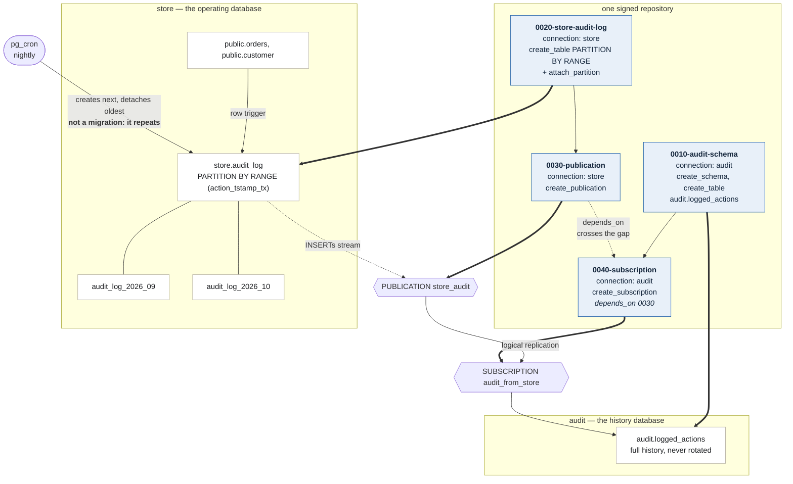

# `audit` — the topology from the landing page, as something you can run

The diagram on <https://sqlambda.github.io/pg_laswell/> is this repository.
Four signed specifications, two databases, and one dependency that crosses
between them: a store that keeps a rolling window of row changes, and an audit
database that keeps every one of them forever.

    bin/setup.sh          # a throwaway cluster, two databases, two ledgers
    bin/sign-specs.sh     # sign the four specifications
    bin/run.sh            # status, dry run, apply, verify
    bin/teardown.sh       # remove all of it

    bin/show-replication.sh   # write rows on store, read them on audit

It builds **two** throwaway clusters, and the second one is not neatness.
Measured here: a subscription whose publisher is the *same* PostgreSQL instance
deadlocks against itself. `CREATE SUBSCRIPTION` takes a transaction id when it
writes `pg_subscription`, then asks the publisher for a replication slot; slot
creation waits for every in-progress transaction to finish — including that
one, which cannot finish until the slot exists. `pg_stat_activity` shows it
exactly:

    store | walsender | active | wait=Lock:transactionid | CREATE_REPLICATION_SLOT

PostgreSQL cannot see that cycle, because half of it is a walsender reached
over a socket. Two clusters is also what a real deployment looks like.

Throwaway rather than yours for two more reasons: logical replication needs
`wal_level = logical`, which is not a setting to turn on in somebody's
development cluster on an example's behalf; and a subscription must
authenticate to the publisher, which trust auth on loopback makes a
non-question where a shared cluster would want a password that pg_laswell
deliberately refuses to accept in a specification.

## What it builds

## The dependency that crosses

`0040-subscription` runs on `audit` and declares `depends_on:
["0010-audit-history-table", "0030-publication"]`. The first is on the same
database; the second is on `store`. pg_laswell holds the subscription until the
publication is recorded applied **in store's own ledger**, because that is
where the answer lives — each database keeps its own.

A change is always single-database. It may *require* a change on a different
one, and that is the whole distinction: PostgreSQL has no cross-database
transaction, so a specification spanning two would be atomic in neither, and a
crash between the publication and the subscription would leave a half-applied
migration that neither ledger describes.

## Why `publish_via_partition_root` is the point

The store's `audit.logged_actions` is partitioned by `action_tstamp_tx`; the
audit database's is an ordinary table. Without `publish_via_partition_root`,
a change to `audit.logged_actions_2026_09` replicates **under that name**, and
the subscriber would need a partition called the same thing — which defeats a
subscriber whose entire job is to keep what the publisher rotates away.

With it, the change travels as the **root** table's, which an ordinary table
can accept. Two consequences the plan warns about, because neither errors until
a row has nowhere to land:

- the subscriber's table must be named after the root, not the partitions —
  which is why both databases call it `audit.logged_actions`;
- **detaching a partition publishes nothing**, so rows the store rotates away
  stay on the audit side. That is the point here, and a surprise anywhere else.

## Where pg_cron would go, and why it is not here

Rotating a partition every night runs *repeatedly*. pg_laswell holds that a
migration is a change to schema state applied **exactly once** — the ledger
keys on the specification digest, and a digest that has succeeded is never
listed pending again. So the rotation is pg_cron's job and this repository does
not pretend to own it. Creating the partitioned table, attaching a partition,
building the publication: applied once, and those are the migrations here.

## The table is the one you already know

`audit.logged_actions` is the shape the PostgreSQL wiki's audit trigger has
used for years — `event_id`, `schema_name`, `table_name`, `relid`,
`session_user_name`, the three `action_tstamp_*` columns, `transaction_id`,
`application_name`, `client_addr`, `client_port`, `client_query`, `action`,
`row_data`, `changed_fields`, `statement_only` — so existing queries mean what
they already meant. `hstore` is created by `bin/setup.sh` before the table that
uses it.

The trigger that writes those rows is not part of this example: it is
application code, it is on the wiki, and it does not change what pg_laswell has
to get right.

## The two keys have to agree

`audit.logged_actions` has primary key `(event_id, action_tstamp_tx)` on **both**
sides, and that is not symmetry for its own sake. The store's copy is
partitioned by `action_tstamp_tx`, and PostgreSQL refuses a unique constraint on
a partitioned table that omits a partitioning column — so the publisher's key
*must* be the pair. A narrower key on the subscriber would then reject rows the
publisher considers distinct, and the subscription stalls on a duplicate-key
error that neither side reports as a migration failure: `bin/run.sh` says
everything applied, and replication has quietly stopped.

`sql/verify.sql` checks the two keys match, because that is the kind of mistake
that looks like success.

## The publication publishes INSERTs only

An audit log is append-only. Sending updates and deletes would let a mistake on
the store erase history on the audit side, which is the one thing an archive
must not allow.
